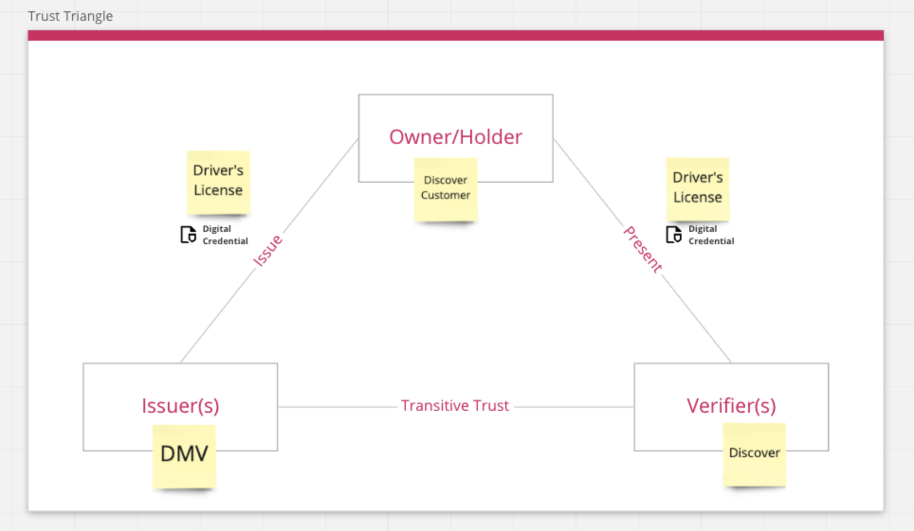
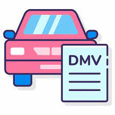

# Account Retrieval Story

>NOTE: Update title and remove all Template Instructions.
 
#### Table of Contents
- [Account Retrieval](#use-case-story-title) 
      - [Table of Contents](#table-of-contents)
  - [Acknowledgements](#acknowledgements)
  - [Business Challenge](#business-challenge)
    - [Concept](#concept)
    - [Approach](#approach)
  - [Vernacular](#vernacular)
  - [Assumptions](#assumptions)
  - [Persona](#persona)
  - [Story](#story)
  - [Demo Workflow](#demo-workflow)
    - [Step 1](#step-1)
    - [Step 2](#step-2)

 
## Acknowledgements

>Template Instructions: List any acknowledgements pertaining to the concepts and resources used in this use case story.
 
1. This scenario leverages a fictitious company called, _Acme Enterprise_. The  Acme Enterprise logo is borrowed from [Katie Wickens](https://steins_kake.artstation.com/projects/ebqgb), a graphics designer.
 
## Business Challenge
The Account Recovery process is a common target for fraudsters. If the process is too simple, then it will quickly result in an account take-over. At the same time, it is a common pain point for legitimate customers. Asking customers to enter lot of data is error prone and can lead to a frustrating experience, as can requiring them to go through numberous steps just to regain access to their account. 

Digital wallets are starting to gain acceptance. The Department of Motor Vehicles (DMV) in some states already allow the creation of digital driver's licenses. Imagine a time where a user has already created a digital driver's license which they can now use to effortlessly recover their account.
 
### Concept
The issuer which is DMV in our cases issues the verifiable Digital credential, the license for the customer. The credentials will be stored in the Digital wallet for the customer. During the account recovery process, Discover would verify the Credentials that are shared by the customer along with the public key of the issuer that will be available in the Block chain or any other public utility. 
 
### Approach

Johnny Customer (Owner/Holder) - This is a customer that has registered an account with Discover and the DMV. They hold a Digital key in their Digital wallet that contains their driver’s license information.

DMV (Issuer) - This issuer is a DMV that has received Johnny Customer’s information to validate that they are who they say they are, and the issuer has issued a digital driver's license for them to be stored in their digital wallet for them to use.

Discover (Verifier) - This is Discover, we use a customer’s digital driver's license to link their identity to their account, since it comes from a credible issuer, we trust that information and let the user recover their account.

 
## Vernacular

>Template Instructions: List and describe any terms that will be used in the story and referenced in the UML diagrams. The current list provides a a sample starter list. 
 
1. **Digital Wallet**: A financial transaction application that runs on multiple device modalities (mobile, computer). These applications store, manage, and present payment and identity instruments.
3. **Merchant**: An entity involved in e-commerce trade.
4. **Checkout Platform**: An e-Commerce Payment Platform (web application) used by merchants to manage the consumer experience and the end-to-end processing of e-commerce transactions.
5. **Credential Verifier Utility**: A merchant would augment their Checkout Platform with support by a vendor solution that allows consumers to: (a) consent to a digital authentication challenge; (b) present a digital credential for identity verification.
6. **Issuer**: A entity that makes assertions about information and delivers digital credentials containing attestations about those assertions.
7. **Credential Generator**: A software component used by the Issuer to manage the generation of new digital credentials.
8. **Credential Issuer Utility**: An Issuer would augment their Credential Generator with support by a vendor solution that allows Issuers to publish a digital credential to consumers.
9. **Public Registry**: A public utility that allows for the registration and discovery of Decentralized Identifiers (DIDs).
 
## Assumptions

>Template Instructions: List any assumptions to be considered in this use case story.
 
1. Use case assumes knowledge of the W3C Standards and open source software that supports the concepts outlined by the [Trust over IP Foundation](https://trustoverip.org/toip-model/).
2. Credential Issuer and Verifier Utility solutions are readily available from 3rd party vendors.
 
## Persona

>Template Instructions: Using the sample persona images in the /images folder, describe the roles of the entities involved in this use case story. The current list provides a a sample starter list. Refer to ./HELP.md#digital-trust-use-cases for example usage.
 
| Actor | Role | Goals | Details |
| --- | --- | --- | --- |
|  | Verifier | Discover would verify the Credentials that are shared by the customer along with the public key of the issuer that will be available in the Block chain or any other public registry. |  |
|    | Issuer | Issue the verifiable credential which is nothing but license for the customer. |  |
|  Johnny | Consumer | Customer will accept the credential from the issuer and share it with the Verifier to be identified during the account recovery.  |  |
 
## Story
>Template Instructions: Using the sample persona images in the /images folder, describe the steps that are involved in the interactive use case story. Refer to ./HELP.md#digital-trust-use-cases for example usage.
 
*  Acme Enterprise decided to issue a XYZ credential. 
 
## Demo Workflow

>Template Instructions: Using the sample persona images in the /images folder, describe the steps od the use case story as they relate to the UML diagram. Refer to ./HELP.md#digital-trust-use-cases for example usage. If desired, a single diagram can be used instead of multiple steps. 
 
### Step 1
 Johnny Customer completes registration for an account with  Discover
 

 
### Step 2
 
After login,  Johnny is prompted to set up a digital driver's license with   DMV
 

 
### Step 3

 Johnny set up the digital driver’s license through the  DMV website and his driver’s license is saved to his digital wallet.

### Step 4

 Johnny forgets his login information for his  Discover account and decides to go through the forgot password flow.

### Step 5

 Johnny is prompted to scan a QR code with his digital wallet app (ConnectMe) to send his digital drivers license details to  Discover

### Step 6

 Discover retrieves these digital attributes from ConnectMe and proceeds to verify on the backend that the information matches an account

### Step 7 

 Discover matches the digital credentials with an account and  Johnny is sent to reset his password - he is now a happy customer again

