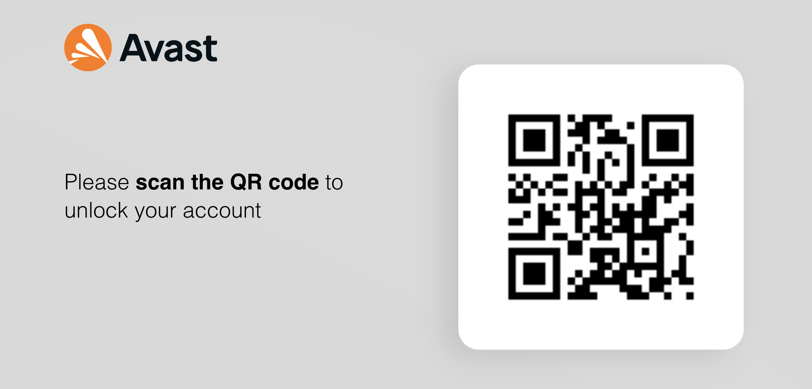
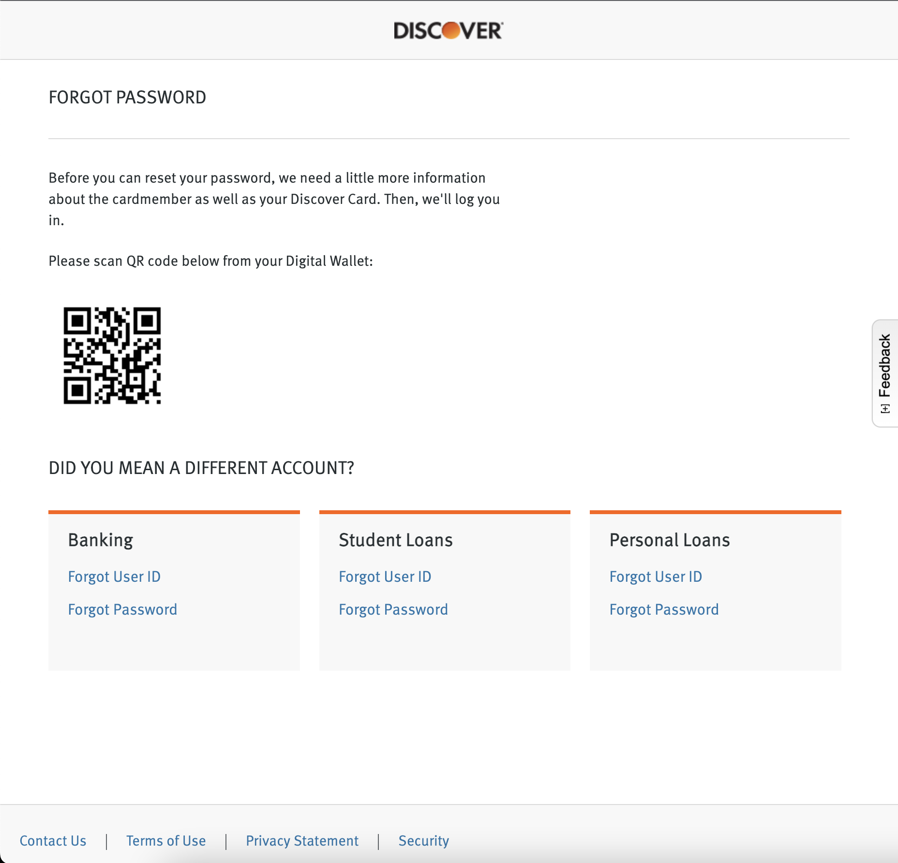
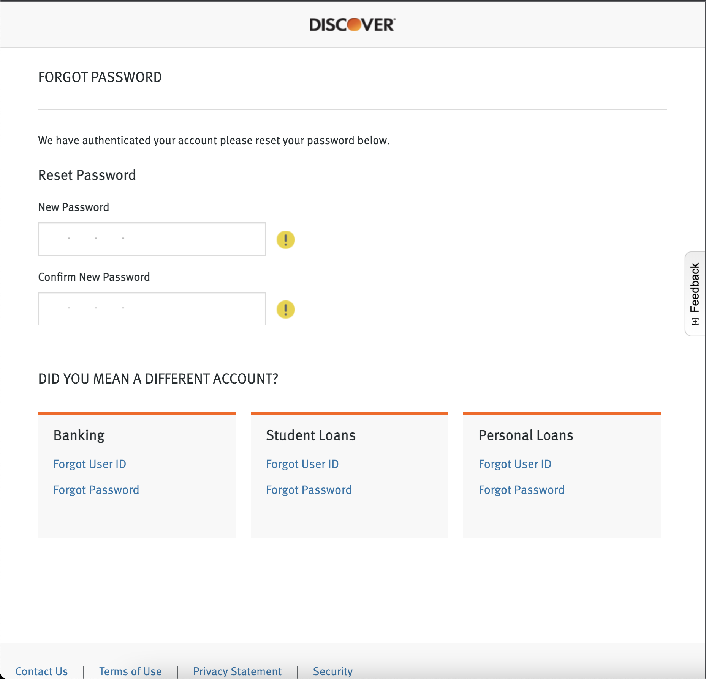

# Prototype Documentation

### Use Case Process Steps 

#### 1: Create Issuer - DMV issuing Driver's License

Created a new issuer for a Driver's License:

   
   
   
   
   

Test out the flow

   
   
   
 
   

### 2: Create Verifier - Discover Account Recovery
   
Create the verifier

   
   
   

And test the flow

   
   
   
   
## Example

Given user has registered their Driver's License with issuer

User goes to Forgot Password Flow

   
   
User scans from ConnectMe app on phone (any digital wallet) and shares

   
   
User authenticates and sent to reset password flow

   

